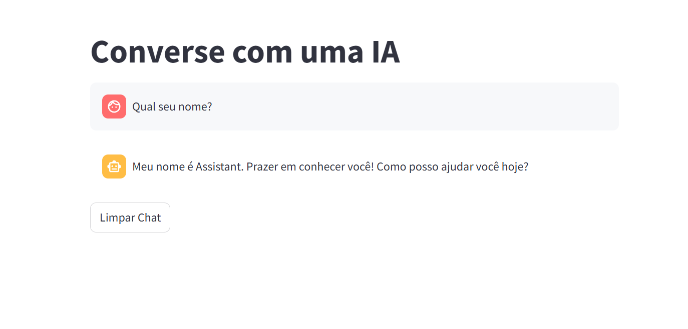

# Chat with AI using FastAPI, LangGraph, and Streamlit

This project provides a real-time chat interface with an AI model using **FastAPI** for the backend and **Streamlit** for the frontend. It utilizes **LangGraph** to manage conversation flow and **Ollama's Qwen2.5-7B** model for generating AI responses.





## Features
- WebSocket-based real-time communication between client and server.
- Uses **LangGraph** to orchestrate AI responses.
- **Streamlit** frontend for an interactive chat UI.
- **FastAPI** backend for WebSocket communication.
- **CORS support** for seamless frontend-backend interaction.

## Project Structure
```
project/
│── chat/
│   ├── backend/
│   │   ├── main.py             # FastAPI server with WebSocket
│   │   ├── manager.py          # ConnectionManager for handling WebSockets
│   │   ├── model.py            # LangGraph-based AI model
│   ├── frontend/
│   │   ├── app.py              # Streamlit chat interface
│── README.md
│── requirements.txt            # Dependencies
```

## Installation
### Prerequisites
- Python 3.11+
- Poetry or pip for package management

### Setup
1. **Clone the repository**
   ```bash
   git clone https://github.com/your-repo/chat-app.git
   cd chat-app
   ```

2. **Install dependencies**
   ```bash
   pip install -r requirements.txt
   ```

## Running the Application

### 1. Start the Backend Server
Running with Docker Compose 
```bash
docker-compose up -d
```
This will:
- Start **Ollama** and pull the `Qwen2.5-7B` model if needed.
- Expose it on port `11434`.

Running the FastAPI WebSocket Server
```bash
uvicorn chat.backend.main:app --reload --host 0.0.0.0 --port 8000
```

### 2. Start the Streamlit Frontend
```bash
streamlit run chat/frontend/app.py
```

## How It Works
1. **FastAPI WebSocket Server**:
   - Accepts WebSocket connections from the frontend.
   - Forwards user messages to the LangGraph agent.
   - Sends back AI responses to the client.

2. **LangGraph AI Agent**:
   - Uses a structured workflow to manage chat interactions.
   - Leverages the **Qwen2.5-7B** model for response generation.

3. **Streamlit Frontend**:
   - Provides a chat UI for users to send messages.
   - Displays AI-generated responses.
   - Maintains session history for context retention.

## Environment Variables
- `ENDPOINT`: WebSocket server URL (default: `ws://localhost:8000/ws/`)
- `MODEL`: AI model to use (default: `qwen2.5:7b`)

